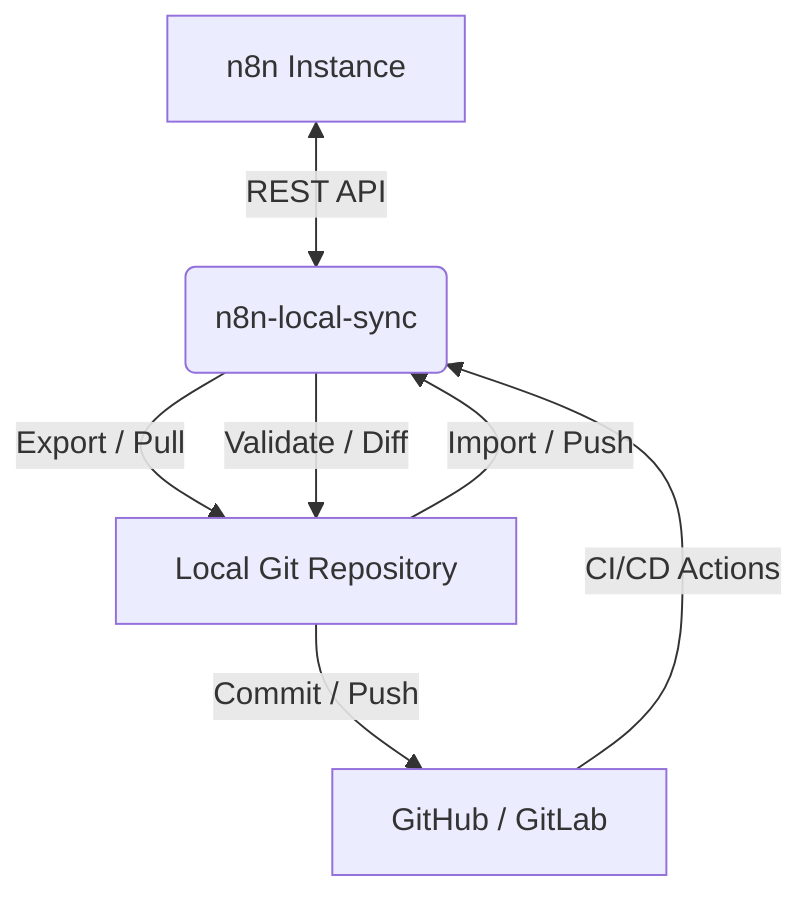

<div align="center">
  <h1>🚀 n8n-local-sync</h1>
  <p><i>A lightweight, developer-first GitOps CLI for versioning, validating, and synchronizing n8n workflows.</i></p>

  [](https://www.python.org/downloads/)
  [](https://opensource.org/licenses/MIT)
</div>

---

## What is it?

**n8n-local-sync** bridges the gap between your [n8n](https://n8n.io/) instances and Git. By treating your n8n workflows as code, you can leverage standard software engineering practices—like version control, peer reviews, CI/CD, and automated deployments—for your automations.

## Why?

Managing n8n workflows through the UI is great for building, but challenging for lifecycle management.
Simple backups aren't enough. You need **version-controlled workflow management**. 

With `n8n-local-sync`, you can:
- Track changes meaningfully using deterministic hashing.
- Review workflow changes in Git pull requests with clean diffs.
- Safely promote workflows across environments (dev → staging → prod) via CI/CD pipelines.

## Features

* 🔄 **Bidirectional Syncing:** Seamlessly pull (`sync` / `export`) and push (`import`) workflows using the official n8n REST API.
* 🧠 **Smart State Tracking:** Detects `LOCAL_MODIFIED`, `REMOTE_MODIFIED`, and `CONFLICT` states before destructive actions.
* 🛡️ **Validation & Security:** Catch invalid JSON structures and detect potential hardcoded secrets (heuristically).
* 🌲 **Git-Native:** Cleans workflow metadata and normalizes node order for deterministic, clean `git diff` outputs.
* 🧪 **Dry-Run Mode:** Simulate changes (`--dry-run`) across all destructive commands before applying them.
* 🏷️ **Tag Filtering:** Target specific environments or modules during export using the `--tag` flag.
* 🤖 **CI/CD Ready:** Configure your environment dynamically using `.env` files or environment variables.

## Architecture



## Installation

You can install `n8n-local-sync` directly from PyPI (once published) or from the source:

```bash
pip install n8n-local-sync
```

## Quick Start

1. **Initialize and export:**
```bash
# Initialize project configuration
n8n-sync init

# Set your API credentials in the generated .env file
# Export workflows from your n8n instance
n8n-sync export

# Version control the results
git add n8n/workflows/ .n8n-sync.yaml
git commit -m "chore: initial workflow export"
git push
```

2. **Synchronize changes:**
```bash
# See what changed between local and remote
n8n-sync diff
n8n-sync status

# Pull remote changes safely (won't overwrite local modifications)
n8n-sync sync

# Push local changes back to n8n
n8n-sync push
```

## Configuration

Configuration resolves in the following priority:
1. **CLI Arguments** (`--force`, `--dry-run`)
2. **Environment Variables** (`N8N_API_KEY`, `N8N_BASE_URL`)
3. **Config File** (`.n8n-sync.yaml`)

> [!IMPORTANT]
> Never store your `N8N_API_KEY` in the `.n8n-sync.yaml` file. Always use environment variables or a `.env` file (which is ignored by Git).

### 🔄 Synching (Pulling) Remote Changes

Update your local repository with changes made directly in the n8n UI. The sync command evaluates the state of each workflow and avoids overwriting local modifications unless forced.

```bash
n8n-sync sync  # or n8n-sync pull
```

**GitOps States Handled During Pull:**
- `UNCHANGED`: Skipped safely.
- `REMOTE_MODIFIED`: Remote changes are pulled, updating the local file.
- `LOCAL_MODIFIED`: Skipped with a warning (to protect local unpushed work). Use `--force` to overwrite local changes.
- `CONFLICT` (both changed): Skipped with a warning. Use `--force` to overwrite local with remote.
- `REMOTE_ONLY`: New remote workflows are pulled and saved locally.
- `LOCAL_ONLY`: Ignored by pull (use `push` to upload them).

*Note: Deletions are not automatically synced in either direction to prevent accidental data loss. If you delete a workflow in n8n, delete the local file manually.*

### 📤 Pushing Local Changes

Upload your local Git-versioned workflows to the remote n8n instance. Like pull, push is state-aware.

```bash
n8n-sync import  # or n8n-sync push
```

**GitOps States Handled During Push:**
- `UNCHANGED`: Skipped safely.
- `LOCAL_MODIFIED`: Pushed to remote, updating the n8n workflow.
- `REMOTE_MODIFIED`: Skipped with a warning (to protect remote changes). Use `--force` to overwrite remote changes.
- `CONFLICT` (both changed): Skipped with a warning. Use `--force` to overwrite remote with local.
- `LOCAL_ONLY`: Creates a new workflow in n8n. The local file is automatically updated with the new ID assigned by n8n.
- `REMOTE_ONLY`: Ignored by push (use `pull` to download them).

## CLI Reference

- `n8n-sync init`: Initializes a project, creating `.n8n-sync.yaml` and `.env.example`.
- `n8n-sync sync` (alias `pull`): Safely synchronizes remote workflows to local files. Warns on conflicts.
- `n8n-sync import` (alias `push`): Pushes local workflows to the remote n8n instance.
- `n8n-sync export`: Forces an export of all (or tagged) remote workflows to local files.
- `n8n-sync diff`: Shows a granular, structural diff between local and remote workflows.
- `n8n-sync status`: Displays a summary table of workflow synchronization states (e.g., `LOCAL_MODIFIED`, `CONFLICT`).
- `n8n-sync validate`: Runs structural and security heuristic validations against local workflow JSON files.

**Common Flags:**
- `--dry-run`: Simulate operations without modifying local files or the remote n8n instance.
- `--force`: Force overwrite conflicts or local modifications during `sync`.

## Git Workflow

The typical GitOps flow looks like this:

1. Build a workflow in your Dev n8n instance.
2. Run `n8n-sync sync` to pull it down locally.
3. Review the structural changes using `git diff`.
4. Create a Pull Request.
5. On merge, a CI/CD pipeline runs `n8n-sync validate` and `n8n-sync push` to deploy the workflow to Production.

## Security

- **Heuristic Secret Scanning:** The `validate` command detects potential hardcoded secrets (`api_key`, `token`, `password`, etc.) in workflow nodes. *Note: This is a heuristic detection, not a strict guarantee.*
- **No Credentials Exposed:** The CLI is designed to never output API keys or authorization headers in error logs or standard output.

## n8n Compatibility

- **Supported/Tested Versions:** n8n `0.164.0` and above.
- **API Requirements:** Requires the n8n Public REST API (v1) to be enabled and accessible. Legacy CLI hacks are not supported.

## Development

```bash
# Clone the repository
git clone https://github.com/DanielDPereira/n8n-local-sync.git
cd n8n-local-sync

# Install with development dependencies
pip install -e .[dev]

# Run linting
ruff check src/ tests/
```

We bundle a pre-commit hook that runs `n8n-sync validate`.
```bash
pre-commit install
```

## Testing

```bash
# Run unit tests
pytest tests/
```

### Integration Testing
You can use the provided `docker-compose.yml` to spin up an ephemeral n8n instance for testing:
```bash
docker compose up -d
```
The instance will be available at `http://localhost:5678`.

## CI/CD

This project uses GitHub Actions for CI/CD:
- **CI**: Runs `pytest`, `ruff`, and `python -m build` on all PRs and pushes to `main`.
- **Publish**: Uses PyPI Trusted Publishing (OIDC) to securely publish new releases on tag.

## Roadmap

- [x] CLI foundation
- [x] Export/import
- [x] Git-friendly workflow files (canonicalization)
- [x] Validation (Heuristic secret scanning)
- [x] Diff & Status (State tracking)
- [x] Dry-run safe mode
- [x] CI and PyPI packaging readiness
- [ ] Integration test suite with Docker
- [ ] Multi-environment support (`--env prod`)
- [ ] Workflow promotion logic

## License

This project is licensed under the MIT License.
